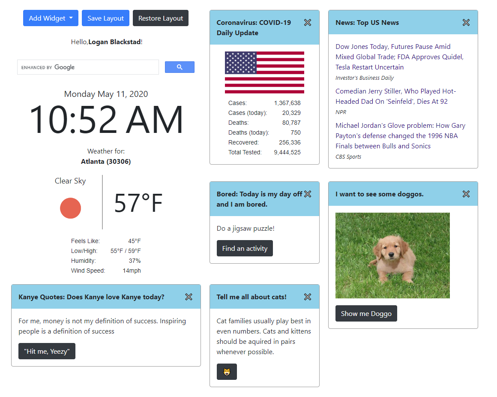

# YOUi Widget Dashboard [https://grrtvnlw.github.io/Group-Front-End-Project/](https://grrtvnlw.github.io/Group-Front-End-Project/) 

## Description

The YOUi web application was created as a simple and easy-to-use dashboard interface that allows the user to add/remove/move/resize "widgets" which display useful/funny information and pictures - including:
- Weather
- News
- Updates on COVID-19
- Motivational/Thoughtful Quotes
- Ideas for Engaging Activities  
- Quotes from Kanye West 
- Random Dog Images
- Random Cat Facts
- Safe For Work Jokes

When the user loads the webpage, he/she can enter their name and location (zip code) and the web application will generate a default dashboard layout of widgets. 

## List of the APIs Used:

This web application employs 10 APIs: 
Weather [openweathermap.org](openweathermap.org)  
News [newsapi.org](newsapi.org) 
COVID Updates [https://disease.sh/](disease.sh)
Kanye Quotes [api.kanye.rest](api.kanye.rest) 
Dog Images [https://dog.ceo/dog-api/](https://dog.ceo/dog-api/) 
Cat Facts [cat-fact.herokuapp.com](cat-fact.herokuapp.com) 
Inspirational Quotes [favqs.com](favqs.com) 
Bored Advice [boredapi.com](boredapi.com) 
Jokes [https://sv443.net/jokeapi/v2](https://sv443.net/jokeapi/v2) 

## What Features You Would Add Next?

- Ability to hide API keys. Since frontend files have visible source code, it would be ideal to build a backend. Using the backend as a very simple API, the frontend would route the API requests without having to use the API keys in the urls.
- Package the web application for easy deployment in "smart-mirror" applications (i.e., raspberry pi, touch-screen lobby boards, elevator screens, etc.)

## Challenges

One of the harder parts of creating this app was rendering the grid stack widgets using the draggable, responsive bootstrap v4-friendly layouts.

Read more about Responsive Layouts using [Grid Stack](https://github.com/gridstack/gridstack.js)

## Next Steps

...

## Contributors:
Tracy Sykes Jr. 
Logan Blackstad 
Gerrit Van Leeuwen 

